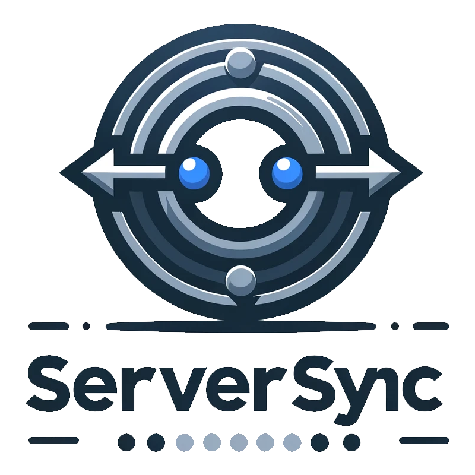

[![Contributors][contributors-shield]][contributors-url]
[![Forks][forks-shield]][forks-url]
[![Stargazers][stars-shield]][stars-url]
[![Issues][issues-shield]][issues-url]
[![MIT License][license-shield]][license-url]

 

  

<h3 align="center">ServerSync</h3>

  

    Synchronize your spigot servers dynamically with your proxy (BungeeCord/Velocity) servers.
     
     
    <a href="https://github.com/AkramLZ/ServerSync/issues/new">Report an issue</a>
    •
    <a href="https://discord.gg/2jzPrcbxbm">Discord Server</a>
     
  

## What is ServerSync?
ServerSync is an innovative plugin crafted to facilitate the real-time synchronization of your Spigot servers with your
proxy servers, supporting BungeeCord and Velocity. It dispenses with the necessity for manual adjustments and system
reboots by automatically managing the registration and un-registration of Spigot servers on the proxy side.

This plugin **REQUIRES** a message broker, currently supporting [Redis](https://redis.io/) only, RabbitMQ will be
implemented later.

## Installation
### For BungeeCord/Waterfall
1. Drop `serversync-bungee.jar` file in your BungeeCord plugins folder.
2. Start the server to generate configuration file, it will be located in `plugins/ServerSync/config.yml`
3. Stop the server.
4. Go to ServerSync configuration file and configure message broker credentials.
5. Once you finish, start your server again and congratulations! you finished configuring it in proxy side.
### For Velocity
It's the same as BungeeCord, but with minor differences:
1. Drop `serversync-velocity.jar` file in your Velocity plugins folder.
2. Start the server to generate configuration file, it will be located in `plugins/serversync/config.toml`
3. Stop the server.
4. Go to ServerSync configuration file and configure message broker credentials.
5. Once you finish, start your server again and congratulations! you finished configuring it in proxy side.
### For Spigot
1. Drop `serversync-spigot.jar` file in your Spigot plugins folder.
2. Start the server to generate configuration file, it will be located in `plugins/ServerSync/config.yml`
3. Stop the server.
4. Go to ServerSync configuration file and configure message broker credentials.
5. Configure your spigot server's name in `server-name` section, this will be used to connect into your spigot server
through proxy.
6. Once you finish, start your spigot server and connect into it from proxy `/server <server name>`. That's all!

## Contributing
We welcome contributions to our project! If you're looking to help out, here's how you can get involved:

### Reporting Issues
If you find a bug or have a suggestion for improving the project, please check our issue tracker first to see if it has
already been reported. If it's new, go ahead and [submit an issue](https://github.com/AkramLZ/ServerSync/issues/new).
Please provide as much detail as possible, including:
- A concise issue title
- A clear description of the issue
- Steps to reproduce the issue
- Any relevant code snippets or error messages

### Submitting Patches
Do you have a fix for an issue or perhaps a new feature you'd like to add? You can submit your code to the project by
following these steps:
- Fork the repository on GitHub.
- Clone your fork to your local machine.
- Create a new branch for your feature or fix.
- Make your changes and commit them with clear, descriptive messages.
- Push the changes to your fork on GitHub.
- Submit a pull request to the main repository, including a clear description of the changes and any other
relevant information.

Please make sure your code adheres to the existing style of the project to ensure consistency.

### Pull Request Guidelines
- Ensure that your code passes any tests and style checks used by the project.
- Update the documentation, if necessary, to reflect your changes.
- Keep your commits as small and focused as possible. If your pull request addresses multiple issues, consider splitting
it into separate requests.
- Include "fixes #issue_number" in your commit message if your pull request resolves an open issue.

## License

This project is licensed under the MIT License - see the [LICENSE](https://github.com/AkramLZ/ServerSync/blob/master/LICENSE)
file for details.

[contributors-shield]: https://img.shields.io/github/contributors/AkramLZ/ServerSync.svg?style=for-the-badge
[contributors-url]: https://github.com/AkramLZ/ServerSync/graphs/contributors
[forks-shield]: https://img.shields.io/github/forks/AkramLZ/ServerSync.svg?style=for-the-badge
[forks-url]: https://github.com/AkramLZ/ServerSync/network/members
[stars-shield]: https://img.shields.io/github/stars/AkramLZ/ServerSync.svg?style=for-the-badge
[stars-url]: https://github.com/AkramLZ/ServerSync/stargazers
[issues-shield]: https://img.shields.io/github/issues/AkramLZ/ServerSync.svg?style=for-the-badge
[issues-url]: https://github.com/AkramLZ/ServerSync/issues
[license-shield]: https://img.shields.io/github/license/AkramLZ/ServerSync.svg?style=for-the-badge
[license-url]: https://github.com/AkramLZ/ServerSync/blob/master/LICENSE
[product-screenshot]: .github/images/serversync-logo.png